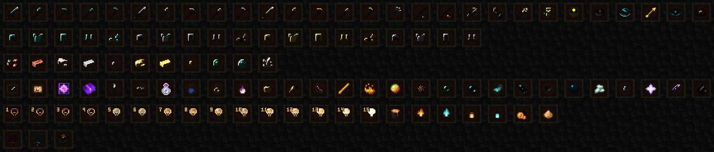
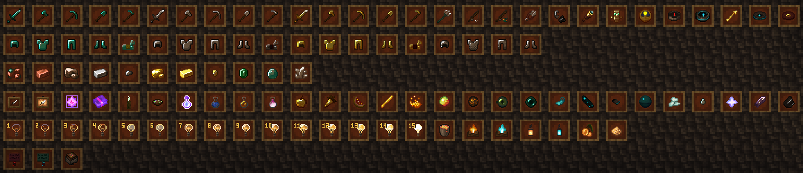
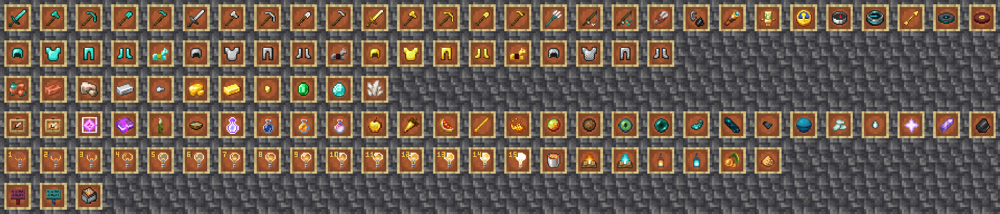
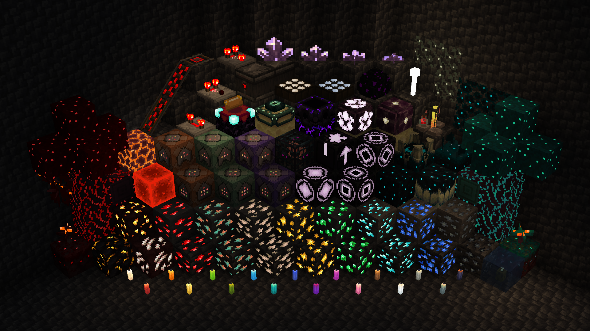
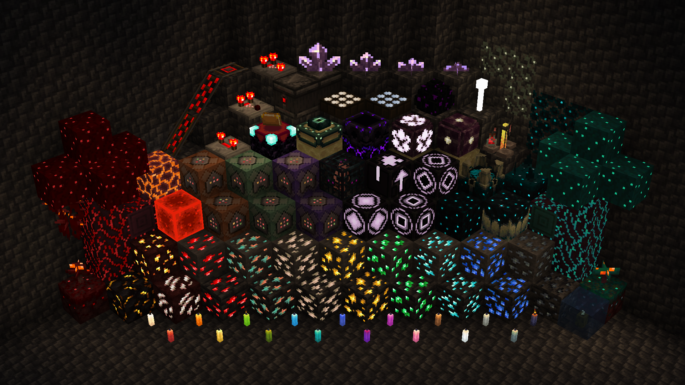
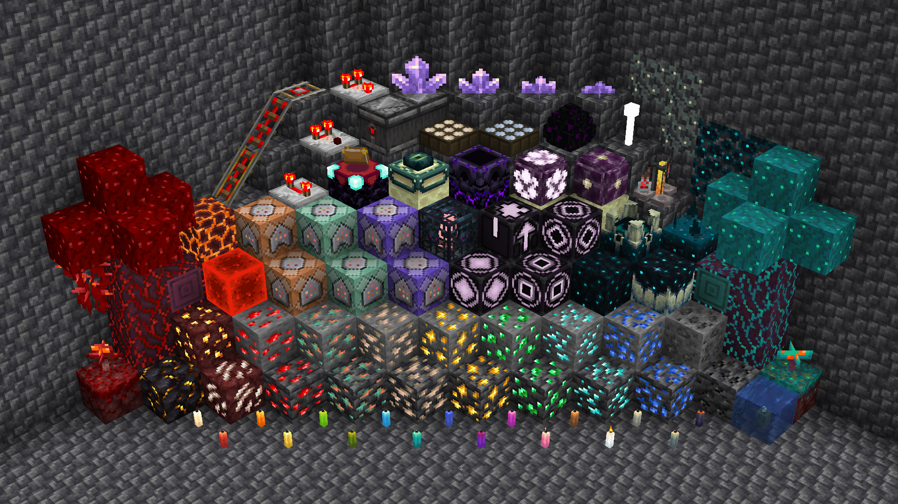

# Emissive Extra
A Minecraft resourcepack to fulfil your emissive desires!\
This resourcepack requires the [Continuity](https://www.curseforge.com/minecraft/mc-mods/continuity) and [Entity Texture Features](https://www.curseforge.com/minecraft/mc-mods/entity-texture-features-fabric) mods in order to function.\
The modpack [Fabulously Optimized](https://www.curseforge.com/minecraft/modpacks/fabulously-optimized) includes both of these mods out-of-the-box as well as greatly improving gameplay performance\
The Optifine mod is not, and will never be supported but may work anyway. 
Since I am not developing for it, use it at your own risk!

## Items

## Blocks

# Entities

...
